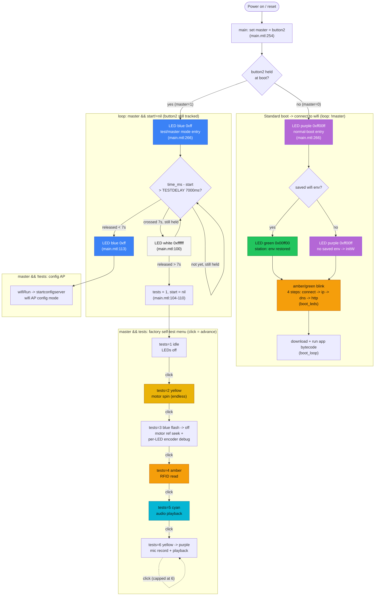

# Boot LED & motor states

On a stock board the only diagnostic signal is **LED colour + ear motion** (no
serial/UART unless the `mod_serial` mod is fitted). This maps every boot LED state
back to the bytecode that drives it, so a colour on the device tells you exactly
which code path is live — useful when bringing up a freshly flashed rabbit.

The boot MTL is readable source (`src/boot/`). It calls C HAL syscalls
(`setleds`/`led`, `motorset`/`motorget`, `button2`) wired in
`src/firmware/src/vm/vlog.c` → `src/firmware/src/hal/{led,motor}.c`.

> **Line numbers** below (`:NNNN`) index Violet's original monolithic
> `boot.0.0.0.13.mtl`, from which `src/boot/*.mtl` is split. The self-test/LED logic
> lives in `src/boot/main.mtl` here; the colour→meaning semantics are unchanged.

---

## "all LEDs purple + ears turn endlessly"

**State: factory motor self-test, `tests==2`.** Not a crash — deliberate burn-in.
Ears spin forever by design; a button click is the only exit.

| Symptom | Cause |
|---|---|
| All LEDs purple | `coltests[2] == 0xffff00` (yellow), shown magenta only **if** this unit has the Waitrony **green/blue swap** (`src/firmware/src/hal/led.c`). |
| Ears turn endlessly | `tests==2` loop flips both motors every ~8.2 s with **no stop condition** (`:2835-2843`). |
| Root condition | `master != 0` → `button2` read **pressed at boot** → factory test sequence instead of normal boot / config AP. |

Reaching it: hold button2 at boot **>7 s** (`TESTDELAY`), release (→ `tests=1`),
then one click (→ `tests=2`).

---

## LED colour reference

`setleds col` = all 5 LEDs to `col` (`:147`). Colour is `0xRRGGBB`, standard RGB
(`set_led`, `src/firmware/src/hal/led.c`). **Caveat:** some Waitrony LED batches ship
with **green/blue swapped**. On a swapped unit: `0xffff00` (yellow) → magenta/purple;
`0xff00ff` (purple) → yellow. Trust the bytecode colour constant and confirm against
the physical unit.

| Colour | Hex | Where | Meaning |
|---|---|---|---|
| Purple/magenta | `0xff00ff` | `:2957` main, master==0 | normal-boot entry (overwritten next loop by `boot_leds`) |
| Purple/magenta | `0xff00ff` | `:2365` `wifiInit` | no saved wifi env → `initW` |
| Blue | `0xff` | `:2957` main, master!=0 | test/master mode entry |
| Blue | `0x0000ff` | `:2483` `gomasterW` | became wifi AP (master) |
| Green | `0x00ff00` | `:2391` `wifiInit` | saved env restored (station) |
| Amber | `0xff8000` | `:2419/:2463` | wifi scan / auth in progress |
| White | `0xffffff` | `:2791` | master mode, button held > `TESTDELAY` (7 s) |
| Amber/green animation | — | `boot_leds` `:2546-2559` | `!master` normal boot: network-progress blink (4 steps: connect→ip→dns→http) |

`coltests` self-test palette (`:2723`):
```
var coltests={0 0 0xffff00 0xff 0xff8000 0xffff 0xff00ff};;
//      idx:  0 1   2        3    4        5      6
```

---

## Flow diagram

The state machine below is entirely **mtl-side** (`src/boot/main.mtl`, `main`+`loop`).
The **FW/C side has no state of its own** — `setleds`/`led` are thin HAL syscalls
(`src/firmware/src/hal/led.c`) that just push a colour to the physical LEDs; every
branch, timer, and transition lives in the mtl loop below.



The three branches the diagram makes explicit, matching how you reach each one:
- **Standard boot** (no button held at power-on) — straight into the wifi-connect
  flow (`STD`), no button interaction at all.
- **Button held, released before 7s** — blue the whole time, drops into the wifi
  **config AP** (`AP`) on release.
- **Button held past 7s** — LEDs go white while still holding; releasing *after*
  that point enters the **factory self-test menu** (`TESTMENU`) instead of the AP.

---

## Boot state machine

`main` (`:2942`) runs once:
1. `set master=button2` (`:2945`) — single button read, decides everything.
2. `confInit; wifiInit 1; loopcb #loop; netstart`.
3. `set start=time_ms`.
4. `setleds if master then 0xff else 0xff00ff` (`:2957`) — **blue if button held, purple if not**.

`loop` (`:2779`) runs every tick:
- `!master` → `wifiRun; boot_leds; boot_loop` — **normal boot**: connect wifi,
  download bytecode (`boot_loop:2590`), LEDs animate amber/green. No ear motion.
- `master && start!=nil` → wait for button release. >7 s held + release → enter
  test mode (`tests=1`); <7 s release → `setleds 0xff`, fall to config AP.
- `master && !tests` → `wifiRun` → config/master AP (`startconfigserver`).
- `master && tests` → **factory self-test menu**, button advances `tests`:

| `tests` | LED (`coltests`) | Test |
|---|---|---|
| 1 | off | idle |
| 2 | `0xffff00` | **motors** — both ears spin, flip dir every 8.2 s, endless (`:2835`) |
| 3 | `0xff` flash → `0` | motor reference seek; blue flash on entry, then all off + per-LED encoder debug (`:2844`, see below) |
| 4 | `0xff8000` | RFID read (`:2894`) |
| 5 | `0xffff` | audio playback (`:2903`) |
| 6 | `0xff00ff` | mic record + playback (`:2917`) |

Endless ears appear in `tests==2` (no stop) and `tests==3` if the position
encoder never reports motion (`get_motor_position` reads PWM capture counter
`FTM0GR`/`FTM1GR`, `src/firmware/src/hal/motor.c`).

---

## What each self-test does, and where the result shows up

Once in `tests==1`, a **short click of button2 advances to the next test**
(`main.mtl:118-247`, capped at `tests==6` — clicking again at 6 stays at 6). There's
no explicit exit; power-cycle the rabbit to leave the menu. None of this is logged
or persisted — every result is **live LED colour and/or audio**, plus an optional
text stream that only exists if `mod_serial` is fitted.

| `tests` | What it does | Where the result shows up |
|---|---|---|
| 1 | Idle placeholder — LEDs off, waiting for the first click. | Nothing to observe. |
| 2 | Both ears spin continuously, flipping direction every ~8.2 s (`d&8192` toggle, `:144-152`). No stop condition, no pass/fail check. | LED stays solid yellow (`0xffff00`). Raw encoder position (`motorget 0`/`motorget 1`) streams over serial every tick via `Secho`/`Iecho` (`:148-150`) — only visible with `mod_serial`. |
| 3 | Runs both ears forward until each encoder's reference notch is found. See the dedicated section below. | Per-ear LED (LED 1 = motor 0, LED 3 = motor 1) + serial `refpos0/1` stream. |
| 4 | Repeatedly polls `rfidGet` for a tag (`:203-211`). | LED: off = no tag, red = `rfidGet` returned `"Error"`, green = good read. On a good read, also echoes `"RFID : <id>"` over serial (`Secholn`, `:208`). |
| 5 | Generates three tone samples and cycles through them (~8.2 s each) via `playStart`/`_wavtestcb` (`:212-225`); live volume knob is `button3` (`sndVol button3`). | No LED encoding — stays cyan (`0xffff`, the entry colour) for the whole test. Result is **audible only**: listen for the tone changing and for volume response. |
| 6 | Press-and-hold `button3` records via `recstart`; release stops and immediately plays back what was recorded (`recstop` → `wavstartlocal`) (`:226-246`). | LED turns yellow (`0xffff00`) while recording, purple (`0xff00ff`) once playback starts. Result is **audible**: hearing your own recorded voice replayed is the pass signal. |

In short: results are **LED colour + audio, not a report** — nothing is written to
flash. The only place raw numbers/text appear (encoder deltas, RFID tag id) is the
`Secho`/`Iecho`/`Secholn` stream (`src/firmware/src/vm/vlog.c`), which requires the
`mod_serial` hardware mod; on a stock board you're reading colours and listening,
nothing more.

---

## `tests==3` per-LED encoder debug (`:2844-2891`)

The most useful debug signal in tree. Unlike other states (`setleds` = all 5),
`tests==3` opens with `setleds 0` (all off) then drives **LED 1 = motor 0** and
**LED 3 = motor 1** individually as each encoder reports a new `motorget`
position. Colour encodes the reference-seek state per ear:

| LED 1 / LED 3 colour | Hex | Condition | Meaning |
|---|---|---|---|
| Purple/magenta | `0xff00ff` | `count==nil` | first ref pulse not yet captured |
| Green | `0xff00` | `i-count == 17` | reference position hit (expected delta) |
| Red | `0xff0000` | `i-count != 17` | pulse at off-position |
| Off | `0` | `count!=nil && i-count>8` | moved away from captured ref |

So **purple on a single ear LED = motor encoder seeking, no reference yet**
(distinct from the all-5-purple status states above). Gated `600ms < d < 10s`
between pulses — slower/faster pulses update position silently without relighting.

This block also emits a terminal stream — `Secho "----refpos0/1 "; Iecholn i-count`
plus `time_ms` + raw position per pulse (`:2864-2870`, `:2881-2887`), routed via
`Secho`/`Iecho` → `src/firmware/src/vm/vlog.c`. Present only in `tests==3`; normal
boot stays LED-only.
