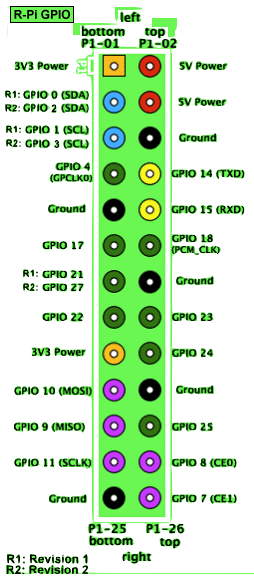

# Reflashing / debricking a Nabaztag:tag (V2) over JTAG (OpenOCD)

Recover a dead **Nabaztag:tag (V2)** (OKI **ML67Q4051**, ARM7TDMI) by reflashing
its firmware over JTAG with OpenOCD. This guide uses a **Raspberry Pi as a
bit-bang JTAG adapter** as the worked example; an FTDI **Bus Blaster** config is
also shipped.

Configs in this dir:

| File | Adapter |
|---|---|
| [`nabaztag-pi.cfg`](nabaztag-pi.cfg) | Raspberry Pi GPIO (bit-bang) — the example below |
| [`nabaztagv2.cfg`](nabaztagv2.cfg) | FTDI Bus Blaster |
| [`target/ml67q4051.cfg`](target/ml67q4051.cfg) | the chip + 128 KB flash bank (shared by both) |

## Flash a Lua app in one command

Once the Pi is set up (step 1 + wiring below, one-time), flashing is a single
task from the repo root — it builds the app, ships this repo's configs + ELF to
the Pi, drives OpenOCD + gdb, verifies the write, and tears the bridge down:

```sh
task lua:firmware:flash                       # APP defaults to lua
task lua:firmware:flash APP=blink             # visible LED blink
task lua:firmware:flash APP=blink PI_HOST=me@other-pi.local
```

The task wraps [`flash.py`](flash.py). It aborts if the JTAG chain check (IDCODE
`0x3f0f0f0f`) fails, before touching flash. The manual steps below are the
fallback for debricking / debugging and document what the task does under the hood.

> `flash.py` runs OpenOCD with only `-f nabaztag-pi.cfg`, so that config must set
> the JTAG clock (`adapter_khz`) itself — it does.

## Why a custom OpenOCD

- Flash is a single 128 KB bank based at `0x08000000`.
- **Mainline OpenOCD cannot program this flash.** The OKI flash routine lives in
  a custom `ml67q40xx` NOR driver by **RedoX**. A stock `apt install openocd`
  fails with `Error: flash driver 'ml67q40xx' not found`. You must build
  **OpenOCD 0.8.0 + RedoX's OKI patch**.
- The Nabaztag JTAG header exposes **RESETN only (no TRST)**, so the OpenOCD
  reset mode is `srst_only` (set in the cfg).
- ML67 and Pi GPIO are both **3.3 V logic** → no level shifter needed.
- Reference: the [journaldulapin debrick guide](https://www.journaldulapin.com/2017/09/10/debriquer-nabaztag/)
  — same chip, same RedoX patch, driven with a Bus Pirate.

## Hardware (Pi example)

- Raspberry Pi with a GPIO header. Tuned for a **Model A+ / Pi 1 / Zero (BCM2835,
  single core)**. Pi 4 needs the right `peripheral_base`; Pi 5 must use the
  `linuxgpiod` driver — neither matches the 0.8.0 build here.
- ~6 jumper wires.
- Triangular ("tamper") screwdriver to open the Nabaztag base (4 screws).
- The Nabaztag's **own power supply** (do not power it from the Pi).

## Wiring: Pi GPIO → Nabaztag 8-pin JTAG

Connector is at the **top-left when facing the rabbit**. Match signal names exactly.

| JTAG signal | Nabaztag pin | Pi BCM GPIO | Pi physical pin |
|---|---|---|---|
| TCK    | 6 | GPIO11 | 23 |
| TMS    | 5 | GPIO25 | 22 |
| TDI    | 4 | GPIO10 | 19 |
| TDO    | 7 | GPIO9  | 21 |
| RESETN | 8 | GPIO24 | 18 |
| GND    | 2 | —      | 25 (any GND) |
| 3.3 V (Vref) | 1 | **leave unconnected** | — |
| (not connected) | 3 | — | — |

> ⚠️ **Verify pin 1 first.** Find the square pad / silkscreen "1" on the board;
> don't assume orientation. A miswired 3.3 V pin can damage the device. Wire with
> **everything powered off**. The Pi shares only **GND** with the rabbit.

Pi 26-pin (P1) header reference for locating the BCM GPIOs above:



## Steps

### 1. Build patched OpenOCD 0.8.0 (one-time)

This is what makes `ml67q40xx` flashing work. On the Pi:

```sh
sudo apt-get update
# tcl provides tclsh, so jimtcl's bundled configure skips its broken
# bootstrap-compile (otherwise fails "No working C compiler found").
sudo apt-get install -y build-essential libtool autoconf automake pkg-config libusb-1.0-0-dev tcl
which autoreconf      # sanity check: must print /usr/bin/autoreconf before continuing

cd ~
wget http://wk.redox.ws/_media/dev/nab/v2/jtag/openocd-0.8.0.tar.gz
wget http://wk.redox.ws/_media/dev/nab/v2/jtag/openocd_0.8.0_oki.patch.gz
gzip -d openocd_0.8.0_oki.patch.gz
tar xzf openocd-0.8.0.tar.gz
cd openocd-0.8.0
patch -p1 < ../openocd_0.8.0_oki.patch        # adds src/flash/nor/ml67q40xx.c
autoreconf -fi

# bcm2835gpio = Pi as adapter. --disable-werror turns off OpenOCD's own -Werror.
# The CFLAGS downgrade gcc 14's new DEFAULT errors (Debian/RPi OS Trixie) so this
# 2014 code still builds; harmless on older gcc (12, Bookworm).
./configure --enable-bcm2835gpio --disable-werror \
  CFLAGS="-Wno-error=implicit-function-declaration -Wno-error=incompatible-pointer-types -Wno-error=int-conversion -Wno-error=implicit-int"

make                                          # Pi A+ is single-core; no -j. Slow (~20-40 min)
sudo make install                             # installs to /usr/local/bin/openocd

/usr/local/bin/openocd --version              # must say 0.8.0
```

> The apt `openocd` (0.12, no driver) may still be first on `$PATH`. Always call
> the freshly built one by full path: `/usr/local/bin/openocd`.

> **Using an FTDI probe (Bus Blaster) instead of the Pi?** Drop
> `--enable-bcm2835gpio`, add `--enable-ftdi`, and build on any host (the OKI
> patch is still required). Flash with `-f nabaztagv2.cfg` in step 4.

### 2. Build firmware (on the dev host)

```sh
task lua:firmware:build APP=blink          # -> lua/firmware/bin/blink.elf (also .bin / .hex)
```

### 3. Copy configs + firmware to the Pi

```sh
# on the dev host, from the repo root
scp -r lua/tools/openocd pi@<pi-ip>:~/
scp lua/firmware/bin/blink.elf pi@<pi-ip>:~/openocd/
```

### 4. Start the JTAG bridge — Pi shell 1

```sh
cd ~/openocd
sudo /usr/local/bin/openocd -f nabaztag-pi.cfg     # sudo: bcm2835gpio needs /dev/mem
```

**This is the make-or-break check.** Look for:

```
JTAG tap: ml67q4051.cpu tap/device found: 0x3f0f0f0f ...
```

- **IDCODE `0x3f0f0f0f` appears** → CPU is alive, the brick was just a bad flash →
  reflashable. Continue.
- **"JTAG scan chain interrogation failed" / all-ones / all-zeroes** → recheck
  wiring (especially pin 1 and the table); if wiring is confirmed good it's a
  deeper hardware fault JTAG can't fix.

### 5. Flash — Pi shell 2

```sh
sudo apt-get install -y gdb-multiarch
cd ~/openocd
gdb-multiarch blink.elf \
  -ex "target extended-remote localhost:3333" \
  -ex load \
  -ex "mon reset run" \
  -ex quit
```

`load` programs flash at `0x08000000` via the `ml67q40xx` driver; `mon reset run`
restarts the CPU into the new firmware.

### 6. Verify

The rabbit should boot (LEDs / ears move). Done.

## Semihosting console + Lua REPL (#91)

The board has **no UART**, so the Lua REPL does console I/O over **ARM
semihosting** — the app issues Thumb `svc 0xAB` and OpenOCD services the
`SYS_WRITEC`/`SYS_READC` syscalls. Proven on hardware with the `console` probe
(`lua/firmware/src/app/console.c`), but the ML67's ARM7TDMI needs one non-obvious
tweak:

- Its **EmbeddedICE is version 1 → no vector catch**, so `arm semihosting enable`
  falls back to a **software** breakpoint at the SWI vector `0x8`. `0x8` is
  **flash-mapped read-only**, so the write fails (`Unable to set 32 bit software
  breakpoint at address 00000008`) and nothing traps.
- Fix: drop the dead soft breakpoint and set a **hardware** one (ARM7TDMI has 2
  watchpoint units; a HW breakpoint needs no memory write). `arm_semihosting()`
  keys only on CPU state (SVC mode, `PC==0x8`, insn `0xDFAB`), so a HW-bp trap is
  serviced identically.

### One command: `task lua:firmware:repl:hw`

The single command to flash an app and read its console (`print()` / the REPL) on
the rabbit:

```sh
task lua:firmware:repl:hw                                   # APP=lua, capture boot output
task lua:firmware:repl:hw APP=console                       # the console probe
task lua:firmware:repl:hw SCRIPT=path/to/commands.lua       # feed REPL input, capture the transcript
```

It builds the app, ships it, and drives the OpenOCD chain below
(`flash.py --semihosting`: flash + `arm semihosting enable` + the HW-bp-at-`0x8`
dance + `resume`), piping `SCRIPT` to the device's stdin and printing what comes
back. The console is **streamed live**, and `flash.py` **early-exits** the moment
the app prints the `<<FV_DONE>>` sentinel — so a scripted run finishes in seconds
instead of waiting out `--run-timeout` (120 s, the backstop for apps that never
print it). New probe apps should `sh_puts("<<FV_DONE>>\n")` before their idle loop.

Run it manually (`console.elf` built with `task lua:firmware:build APP=console`):

```sh
sudo /usr/local/bin/openocd -f nabaztag-pi.cfg \
  -c init -c "reset halt" \
  -c "flash write_image erase console.elf" \
  -c "arm semihosting enable" \
  -c "reset halt" -c "rbp 0x8" -c "bp 0x8 4 hw" \
  -c "resume"
```

`SYS_WRITEC` output lands on **OpenOCD's stdout** (`putchar`); `SYS_READC` reads
its stdin. Expected: `M3 WRITEC OK`, then the CPU idles in `main`.

The **Lua REPL runs the same way** — flash `lua.elf` and pipe Lua into OpenOCD's
stdin; results come back on stdout (per-char, so slow):

```sh
printf '1+1\n6*7\n10//3\nprint("lua on rabbit ok")\n' | sudo timeout 160 \
  /usr/local/bin/openocd -f nabaztag-pi.cfg \
  -c init -c "reset halt" -c "flash write_image erase lua.elf" \
  -c "arm semihosting enable" \
  -c "reset halt" -c "rbp 0x8" -c "bp 0x8 4 hw" -c "resume"
```

Prints the banner + `> 2 / 42 / 3 / lua on rabbit ok`. Integer math is exact;
float *printing* is still stubbed (see the Lua firmware README) — stick to integer
ops for clean output. `timeout` ends the otherwise-forever OpenOCD server loop.
`SYS_WRITE0` (whole-string) is best avoided — OpenOCD 0.8.0's read loop runs away
on it; per-char `SYS_WRITEC` (what newlib `_write`/Lua `print` use) is stable.

> Deferred follow-up: patch OpenOCD's `arm7_9_setup_semihosting` to use
> `BKPT_HARD` on cores without vector catch — then plain `arm semihosting enable`
> works, no `rbp`/`bp` dance (needs an OpenOCD rebuild).

## Troubleshooting

- **`flash driver 'ml67q40xx' not found`** → you're running the apt OpenOCD, not
  the patched 0.8.0. Use the full path `/usr/local/bin/openocd` and confirm
  `--version` says 0.8.0.
- **`DEPRECATED! use 'adapter gpio ...'` then a config error** → same cause: that
  warning comes from the modern apt OpenOCD. The cfgs use 0.8.0 syntax
  (`interface bcm2835gpio`, `bcm2835gpio_jtag_nums`, `bcm2835gpio_srst_num`).
- **Build fails on a warning** → ensure `--disable-werror` was passed.
- **jimtcl: `No working C compiler found` during configure** → gcc 14 rejects
  jimtcl's bootstrap `jimsh0.c` (undeclared `isatty`). Fix: `sudo apt-get install
  -y tcl` (lets its configure use system `tclsh` instead of compiling jimsh0).
- **`make` errors with `implicit-function-declaration` / `incompatible-pointer-types`
  / `int-conversion`** → gcc 14 promotes these to errors by default. Add the
  `CFLAGS="-Wno-error=..."` shown in the configure step and re-`./configure`.
- **IDCODE shows but rabbit still won't boot after flashing** → the firmware build
  itself may be broken (mid-feature work). Flash a **known-good earlier commit**:
  checkout the commit, rebuild, repeat step 5.
- **Flash slow / minor warnings mid-write** → bit-bang is slow but reliable for
  128 KB; only a final failure matters.
- **Inspect interactively** → `telnet localhost 4444` while OpenOCD runs, then
  `halt`, `reg`, `flash banks`.

## Generalising

`flash.py`'s defaults (`--host tobi@jtag.local`, native-GPIO `nabaztag-pi.cfg`,
`--remote-dir openocd`) suit the current single-rig setup; every one is an
overridable flag, so another Pi/user/adapter needs no code change — just args (or
`PI_HOST=` on the task).

What is *structurally* Pi-specific is the remote model itself: scp/ssh + `sudo`
(for `/dev/mem`). A local FTDI probe (Bus Blaster + `nabaztagv2.cfg`, OpenOCD on
this host, no ssh/sudo) would be a `--local` path; `flash.py` keeps
copy/start/stop in their own functions so that day it's a branch, not a rewrite.
Not built yet (no probe on hand to test against).
